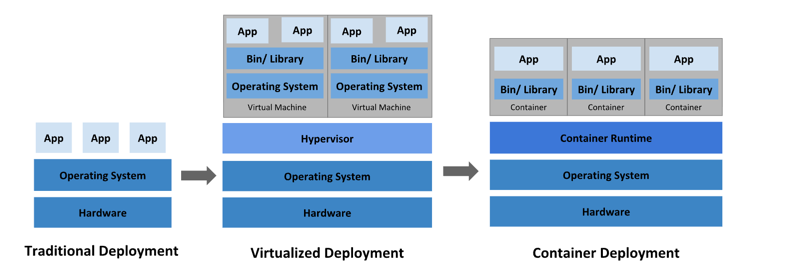
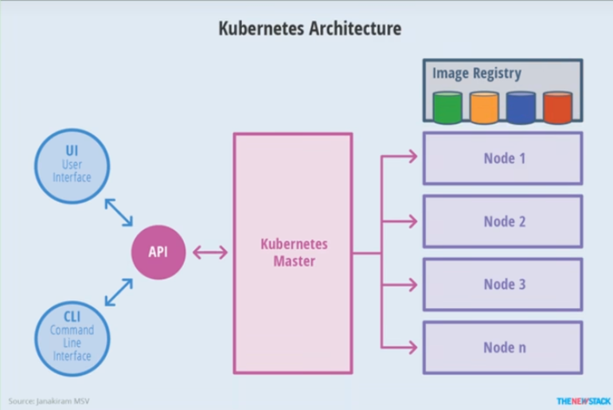

# K8S

* [官方文档](https://kubernetes.io)
* [中文文档](https://kubernetes.p2hp.com/)

##  01 什么是k8s,为什么要用它

1. 传统部署, 是服务部署在主机上, 导致环境不隔离, 不能控制每个服务占用的资源
2. 虚拟机部署, 太浪费
3. 容器化, 环境隔离,资源隔离, 缺点, 容器多了,不容易管理容器
4. k8s 出现, 做容器编排

## 02 k8s 的架构
整体来说就是2个  控制面(master) 和 工作面(node)

### 控制面/master节点
- etcd : 数据库
  - 用来保存集群的重要数据(etcd是一个键值数据库)
- kube-apiserver
  - 暴露了api, 供外界访问, 简单来说就是 k8s的入口
- kube-scheduler : 调度器
  - 用户请求 apiserver ,部署一个nginx
  - apiserver 与 etcd 交互, 将用户的请求存储进入etcd
  - kube-scheduler 去 读取etcd, 看看哪些节点可以调度, 调度哪个节点上, 并告诉 apiserver 
- controller-manager : 控制器管理器
  - 有很多的控制器 ,比如DeploymentController, ReplicaSetController, NodeController, EndpointController等
  - scheduler负责调度 给 controller  
- cloud-controller-manager
  - 云提供商相关的控制器 

### 工作面/node节点 
node节点是真正运行

- kubelet : 在节点上管理容器
  - 与 master 节点上的 kube-api-server 交互, 获取指令, 操作pod, 对pod进行 创建, 更新, 删除等生命周期管理,还有对卷的管理  
- kube-proxy : 网络解决方案
  - 网络代理
- container runtime : 容器运行时
  - 例如 docker, containerd

容器运行在Pod中 !!!!!! 这句话很重要
一个Pod可以包含 1个或 多个容器

解释: 在docker中, 容器是独立的
但是在 k8s 中 , 多个容器被封装在了一个 Pod中
这么做的目的其实就是 , 多个容器 形成一个逻辑单元, 一起被调度, 一起被管理 
pod 是 k8s 中最小的部署单元(也就是说在 k8s中 不能在容器层面部署 )

- 这张图说的就是 k8s 的架构, 是如何公国的
1. master节点/控制面节点 暴露了 通过 APIServer 提供的接口
2. 用户 CLI / UI页面 调用 API 与 Master节点进行交互
3. Master节点,在去操作Node, Node才是真正干活的

 

- controllers: 是更高层次的抽象, 部署管理 Pod;
    - ReplicaSet : 副本集, 确保副本数达到要求
    - Deployment : 无状态应用部署
    - StatefulSet : 有状态应用部署
    - DaemonSet : 确保所有 Node 都运行一个指定的 Pod,典型的就是 log-collector,single-rep
    - Job : 一次性任务
    - CronJob : 定时任务

- Deployment : 
  - 定义一组Pod的需求, 版本等
  - Deployment 定义了一组 Pod 的副本数、容器镜像版本、更新策略等期望状态。通过 ReplicaSet 来控制 Pod 的扩缩容和版本迭代，并支持滚动更新和版本回滚（对应 K8s 中的 RollingUpdate 和 undo）。

- service: 
    - 定义一组pod的访问规则
    - Pod的负载均衡 提供一个或多个Pod的访问地址
    - Service 是 K8s 中一种抽象资源，它通过 Label Selector（标签选择器） 关联一组 Pod，并为这组 Pod 提供一个固定的、不变的访问入口（VIP 或 DNS 域名），同时在后端 Pod 动态变化（扩容或重启）时，自动维护 Endpoints（端点列表），实现透明的四层负载均衡和服务发现。

    
解释: 
    - 例如一个 购物车服务, 我们部署4份, 其实就是部署4个pod
    - service 其实就是4个pod的负载均衡, 提供一个访问地址
    - 用户访问这个地址, 其实是访问的这个service

controllers 和  Deployment ,service 都和 pod 有关系?
答案是肯定的：它们全都围绕 Pod 转，但分工截然不同。

可以把它们想象成一个外卖配送系统，Pod 就是具体的外卖骑手。这三者分别负责骑手的“数量管控”、“版本发布”和“找路接单”。

1. 通过 kubectl 提交一个创建 RC（Replication Controller） 的 YAML/JSON 请求，该请求经由 API Server 鉴权和处理后，将 RC 的定义写入 etcd 中。
2. Controller Manager 中的 Replication Controller 控制器通过 API Server 的 Watch 机制监听到该 RC 事件。
3. 该控制器分析后发现当前集群中还没有它所需的 Pod 实例，于是根据 RC 的 Pod 模板，自动创建出对应数量的 Pod 资源对象（此时 Pod 处于 Pending 状态，且 nodeName 字段为空），并将这个 Pod 的定义通过 API Server 写入 etcd。
   4.（你原文缺失的关键步骤） Scheduler（调度器）通过 API Server 的 Watch 机制监听到了这个新创建的、未被调度的 Pod（即 nodeName 为空的 Pod）。
5. Scheduler 立即执行复杂的调度算法，为该 Pod 选定一个最优的 Worker Node，然后将绑定结果（nodeName 赋值）通过 API Server 更新写入 etcd。
6. 目标 Node 上的 Kubelet 进程通过 API Server 监听到这个已被调度到自己节点上的“新 Pod”，按照其定义启动容器，并负责其生命周期管理。
7. 随后，我们通过 kubectl 提交一个映射到该 Pod 的 Service（ClusterIP/NodePort 等） 的创建请求，写入 etcd。
8. Controller Manager 中的 Endpoint Controller（端点控制器） 通过 Label Selector（标签选择器） 查询到关联的 Pod 实例（并监控其健康状态），然后生成 Service 的 Endpoints（端点列表） 信息，通过 API Server 写入 etcd。
9. 所有 Node 上运行的 kube-proxy 进程通过 API Server 监听 Service 和对应的 Endpoints 变化，在各自节点上设置 iptables/IPVS 规则，建立一个集群内的软件负载均衡器，实现 Service 访问到后端 Pod 的流量转发。

